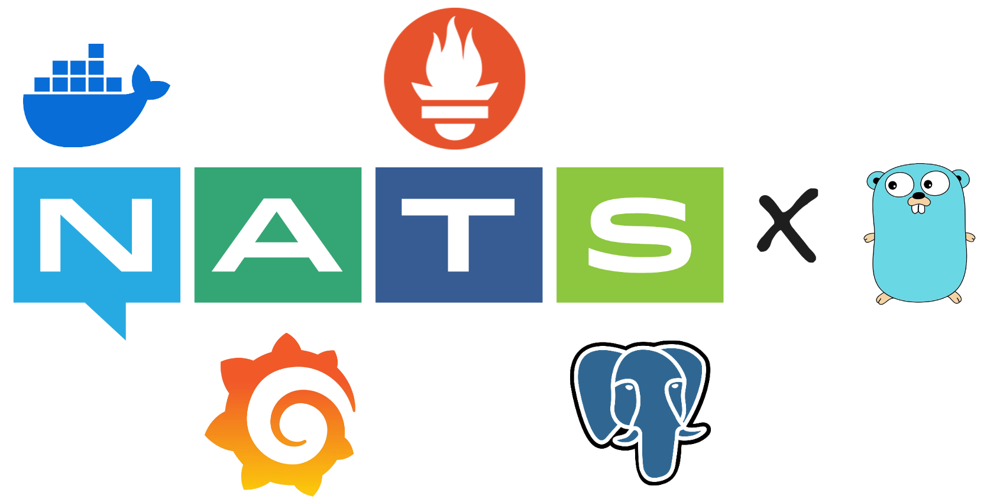
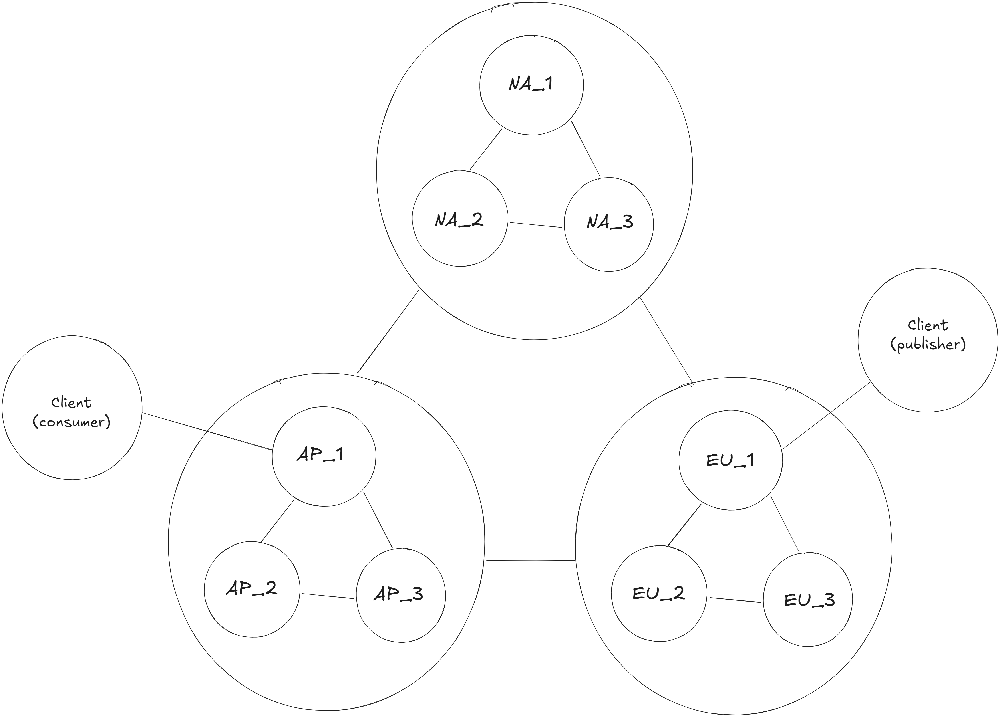
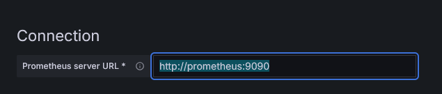
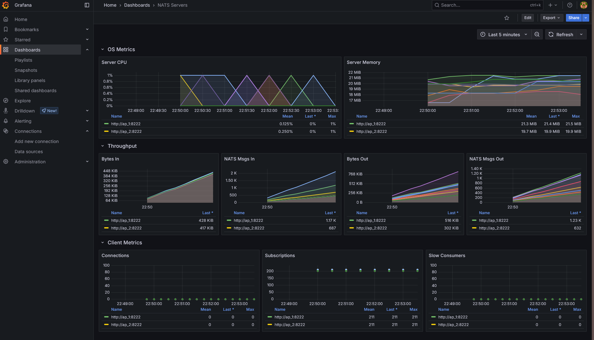

# NATS Implementation using GO

<p align="center">
  
</p>

This is just a simple implementation of NATS using Go Programming Language. Big thanks to official [NATS documentation](https://docs.nats.io/nats-concepts/overview) and [Synadia](https://github.com/synadia-io).

In this repository, all are set. The key points here are:

- NATS server implemented as a Supercluster that consist of AP, NA, and EU. Each cluster is represented a geography and each cluster has 3 nodes. (we don't really need NA cluster in this simulation, but the best practice for redudancy are 3 clusters)

<p align="center">
  
</p>

- This implementation use creds for the authentication. You can change it like using username and password (not recommended), token or a nkeys. [Securing NATS](https://docs.nats.io/running-a-nats-service/configuration/securing_nats/auth_intro)
- To generate the creds and also the resolver, i use nsc tool. you can check it here: [NSC Tool Documentation](https://docs.nats.io/using-nats/nats-tools/nsc)
- Current Implementation are using JetStream and Consumer. You can also explore more about [Pub-Sub](https://docs.nats.io/nats-concepts/core-nats/pubsub), [Request and Reply](https://docs.nats.io/nats-concepts/core-nats/reqreply), [Queque Groups](https://docs.nats.io/nats-concepts/core-nats/reqreply) and other [JetStream](https://docs.nats.io/nats-concepts/jetstream) feature.
- The monitoring uses several components addition, which are [prometheus-nats-exporter](https://github.com/nats-io/prometheus-nats-exporter), [Prometheus](https://prometheus.io/), and [Grafana](https://grafana.com/). We use monitoring dashboard template for Grafana that also provided by prometheus-nats-exporter repository.

Even though the repo includes the creds and resolver configuration, you still need to add/generate all of the account credentials to your local nsc and then push it to the nats server. Don't worry. The repo has a script to help you. This repo provides a preparation script. run this from your root of project.

(I'm sorry that this is just available with unix and unix-like base. So for Windows user, i suggest you to use WSL with docker support instead)


## Preparation

before run the script. clone this repo first to your host by using below command

```bash
git clone https://github.com/Daffadon/nats-example --depth 1
```

After clone go to your project and execure below command

```bash
chmod +x ./deployment/bin/prepare.sh
./deployment/bin/prepare.sh
```

p.s. if it's not working, make an issue and i'll guide you or you can check my github profile, go to my website, you'll found my email and send an email to me.

The script will install NSC and generate operator, account, user, and configuration that we need to authenticate and authorize the client to use nats and jetstream (publisher and consumer). Also it's install the docker and docker-compose if your system doesn't have that.

## Run

After preparation, you can run start script from the root of your project.

```bash
chmod +x ./deployment/bin/start.sh
./deployment/bin/start.sh
```

Start script will up the Super Cluster, Nats Monitoring with Grafana and Prometheus, and also PostgreSQL that will be used by the consumer in this example. The url string to make a connection to the db has defined in the .env file.

For every nats server in the docker.compose.nats.yml, i've mount the config for each cluster in the service definition. I also open the port 8222 for monitoring purpose and open 2 port in 2 different cluster that we will use for the client connection in this example. The last step is push the configuration from the preparation script to the one of the nats server. In this case, we will push it to the ap_1. All of the cluster that connected to the ap_1 would know about the configuration automatically.

## Monitoring

Before we jump the example, let's set up the monitoring dashboard. I've provide the grafana dashboard that i got from prometheus-nats-exporter example and prometheus config for scraping from what nats-prometheus-exporter exported.

1. Open http://localhost:3000 to open Grafana, Default username/password is admin/admin
2. Connection > datasource > prometheus > fill "http://prometheus:9090" without quote in connection input > save & test

<p align="center">
  
</p>

3. Go to Dashboard > New > import. Upload one of json files from deployment/grafana directory and choose previous datasource that has been built. You'll see something like this. do the same step for another json file.

<p align="center">
  
</p>

## Example

> **Note:** this is using golang version 1.24.2 as you can see in the go.mod.

This repository has example how to use jetstream publisher and consumer. You can see from the architecture, the publisher is send data to a subject from EU_1 and client get the data via consumer in AP_1. Consumer here is not a client, consumer is a component that like it's name has a goal to consume and live in the nats server. the client just call the consumer, identified by a name, to retrieve the data.

Open your terminal and run below command from the root of project to run the publisher.

```bash
cd publish && go run main.go
```

In your other terminal, run below command from the root of project to run the consumer/subscriber.

```bash
cd consumer && go run main.go
```

## Stop

to stop all of the services, run below command from the root of the project:

```bash
chmod +x ./deployment/bin/stop.sh
./deployment/bin/stop.sh
```
